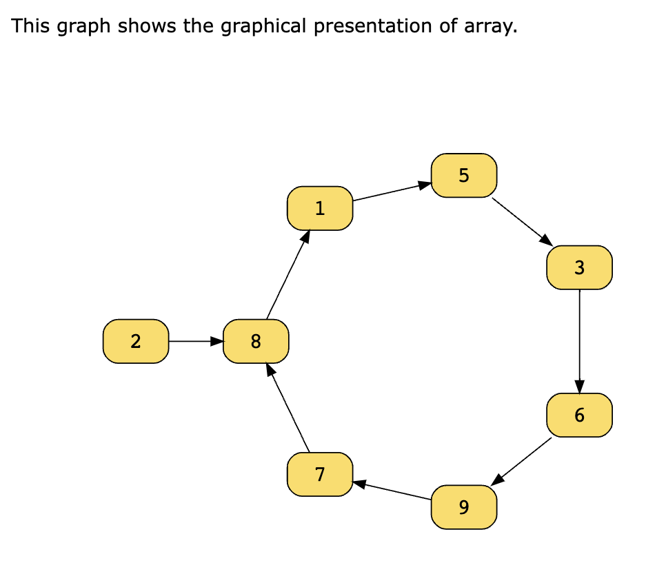
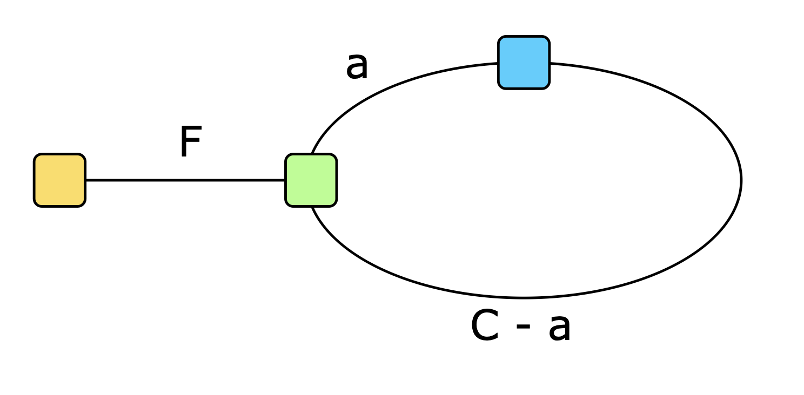

# Slow and Faster Pointer Pattern

Similar to the `two pointers` pattern, the fast and slow pointers pattern uses two pointers to traverse an iterable data structure, but at different speeds, often to identify cycles or find a specific target. The `two pointers` pattern focuses on comparing data values, whereas the fast and slow pointers method is typically used to analyze the structure or properties of the data.

The key idea is that the pointers start at the same location and then start moving at different speeds. The slow pointer moves one step at a time, while the fast pointer moves by two steps. If a cycle exists, the two pointers will eventually meet during traversal. This approach enables the algorithm to detect specific properties within the data structure, such as cycles, midpoints, or intersections.

## Case Study: Find the Duplicate Number

Given an array of positive numbers, `nums`, such that the values lie in the range
[1,n], inclusive, and that there are n+1 numbers in the array, find and return the duplicate number present in `nums`. There is only one repeated number in `nums`, but it may appear more than once in the array.

_Note: You cannot modify the given array nums. You have to solve the problem using only constant extra space._

Example: in array [1,3,4,2,3,3], the output is expected as `3`.

### All Solutions

There are more than one ways to do this. Based on Leetcode submission, it can have 9 methods!
https://leetcode.com/problems/find-the-duplicate-number/solutions/1892921/9-approaches-count-hash-in-place-marked-sort-binary-search-bit-mask-fast-slow-pointers/

Let's skip the straightforward ones, like Brute Force (2 Loops), or using extra array or Hashmap to store the frequency, or sorting and then loop, but focus on the Slow and Fast Pointer approach.

### Slow Faster Pointer Solution

The key is to understand **how to treat the input array as a linked list**.

Take the array [1,3,4,2] as an example, the index of this array is [0,1,2,3], we can map the index to the nums[n]. `0→1→3→2→4→3→2`

This solution involves two key steps. First, we’ll identify the cycle, confirming the duplicate number’s existence. Next, we’ll locate the entry point of this identified cycle, which represents the duplicate number in the array.

In the first step, the slow pointer moves once, while the fast pointer moves twice as fast as the slow pointer until both of the pointers meet each other. Since the fast pointer is moving twice as fast as the slow pointer, it will be the first one to enter and move around the cycle. At some point after the slow pointer also enters and moves in the cycle, the fast pointer will meet the slow pointer. This will be the intersection point.



In step two, we’ll start moving again in the cycle, but this time, we’ll slow down the fast pointer so that it moves with the same speed as the slow pointer. At this point, we move the slow pointer to back start from the 0th position. And the fast pointer will start from the intersection point. After a certain number of steps, the slow pointer meets the fast pointer again. This is the ending point for both pointers. This common ending position will be the entry point of the cycle.

### Understand Why

Now, let’s try to understand how it is that our solution is able to `always` locate the entry point of the cycle.

The fast pointer is traversing two times faster than the slow pointer. This can be represented by the following equation:

```
d(fast) = 2d(slow)​
```

Here, d represents the number of elements traversed(distance).

Let’s look at the following diagram to see the steps taken by the slow and fast pointers from the starting point to the intersection point:



In the diagram above:

- Green represents the entry point of the cycle.
- Blue represents the intersection point.
- Yellow represents the starting point.
- F represents the steps taken from the starting point to the entry point.
- a represents the steps taken to reach the intersection point from the entry point.
- C represents the cycle length, in terms of the number of steps taken to go once around the cycle.

The slow pointer travels F steps from the starting point to the entry point of the cycle and then takes a steps from the entry point to the intersection point of the cycle, that is, the point where both pointers intersect. So, we can express the distance traveled by the slow pointer in the form of this equation:

```
d(slow) = F + a
```

In the time it takes the slow pointer to travel F+a steps, the fast pointer, since it’s traveling twice as fast as the slow pointer, it has also traveled around the cycle at least once. so

```
d(fast) = F + a + C
```

as also `d(fast) = 2d(slow)`, so we can simplify this equation to be `F = C - a`.

As we can see from the diagram, `C−a` is, in fact, the distance from the intersection point back to the entry point. This illustrates `why`, when we move one pointer forward, starting at the intersection point, and another pointer from the starting point, the point where they meet is the entry point of the cycle.

### Solution Implementation

```python
def find_duplicate(nums):
    fast = slow = nums[0]

    while True:
        slow = nums[slow]
        fast = nums[nums[fast]]
        if slow == fast:
            break

    slow = nums[0]

    while slow != fast:
        slow = nums[slow]
        fast = nums[fast]

    return fast
```
