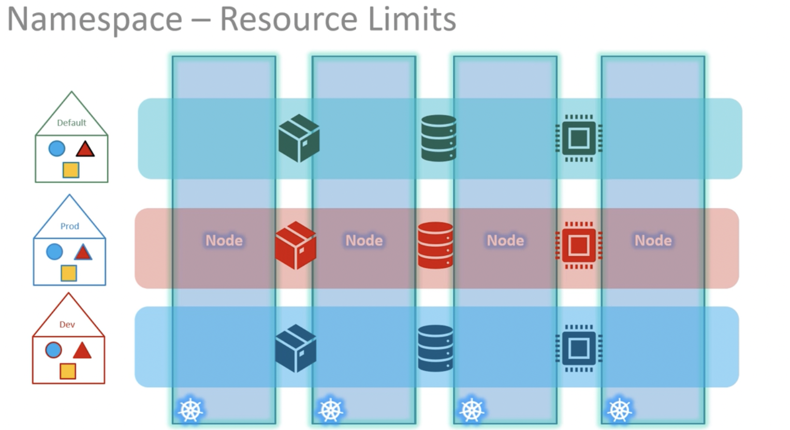

## K8s Components

Ref: https://kubernetes.io/docs/concepts/overview/components/

### Kind and Version

| Kind       | Version |
| ---------- | ------- |
| POD        | v1      |
| Service    | v1      |
| ReplicaSet | apps/v1 |
| Deployment | apps/v1 |

### Namespaces VS Nodes

### Resource Quota

can be used to limit resource quota in a namespace.

### Deployment

A Deployment provides declarative updates for Pods and ReplicaSets.

You describe a desired state in a Deployment, and the Deployment Controller changes the actual state to the desired state at a controlled rate. You can define Deployments to create new ReplicaSets, or to remove existing Deployments and adopt all their resources with new Deployments.

**Note: Do not manage ReplicaSets owned by a Deployment.**

## API Groups

https://kubernetes.io/docs/reference/generated/kubernetes-api/v1.29/#api-groups

### Namespace

To access applications/dbs in another namespace, need to use its service DNS.
e.g. to access the db-service in `dev` ns, use the DNS `db-service.dev.svc.cluster.local`
