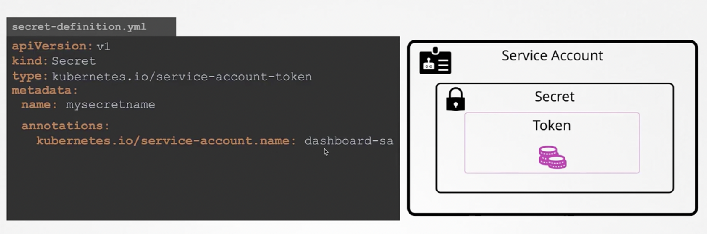

## SecurityContext

SecurityContext can be added into Pod level or container level.

But capabilities are only supported at container level but NOT pod level.

## Service Account

A service account provides an identity for processes that run in a Pod, and maps to a ServiceAccount object.

Every Kubernetes namespace contains at least one ServiceAccount: the default ServiceAccount for that namespace, named `default`.
If you do not specify a ServiceAccount when you create a Pod, Kubernetes automatically assigns the ServiceAccount named default in that namespace.

An application running inside a Pod can access the Kubernetes API using automatically mounted service account credentials.

How standalone secret asscociated with service account:



(Need to create service account first before secret creation.)

Note: Can't update service account of a Pod, must delete and recreate the pod to change the SA.

## Resources requests and limits

When you specify a Pod, you can optionally specify how much of each resource a container needs. The most common resources to specify are CPU and memory (RAM).

When you specify the resource `request` for containers in a Pod, the `kube-scheduler` uses this information to decide which node to place the Pod on. When you specify a resource `limit` for a container, the `kubelet` enforces those limits so that the running container is not allowed to use more of that resource than the limit you set. The `kubelet` also reserves at least the request amount of that system resource specifically for that container to use.

```
containers:
  - name: app
    image: images.my-company.example/app:v4
    resources:
      requests:
      memory: "64Mi"
      cpu: "250m"
      limits:
      memory: "128Mi"
      cpu: "500m"
```

### limit range

By default, containers run with unbounded compute resources on a Kubernetes cluster.

Using Kubernetes `resource quotas`, administrators (also termed cluster operators) can restrict consumption and creation of cluster resources (such as CPU time, memory, and persistent storage) within a specified namespace.

Inside a namespace, a `LimitRange` is a policy to constrain the resource allocations (limits and requests) that you can specify for each `applicable object` kind (such as `Pod` or PersistentVolumeClaim) in a namespace.

A LimitRange provides constraints that can:

- Enforce minimum and maximum compute resources usage per Pod or Container in a namespace.
- Enforce minimum and maximum storage request per PersistentVolumeClaim in a namespace.
- Enforce a ratio between request and limit for a resource in a namespace.
- Set default request/limit for compute resources in a namespace and automatically inject them to Containers at runtime.

A LimitRange is enforced in a particular namespace when there is a LimitRange object in that namespace.

```
apiVersion: v1
kind: LimitRange
metadata:
  name: cpu-resource-constraint
spec:
  limits:
  - default: # this section defines default limits
      cpu: 500m
    defaultRequest: # this section defines default requests
      cpu: 500m
    max: # max and min define the limit range
      cpu: "1"
    min:
      cpu: 100m
    type: Container

```

## Taints and Tolerations

Taints are set on Nodes, while Tolerants are set on Pods.

Tolerations:

```Pod
spec:
  containers:
    - name: nginx
      image: nginx
  tolerations:
    - key: "app"
      operator: "Equal"
      value: "blue"
      effect: "NoSchedule"
```

## Node Selector

```
apiVersion: v1
kind: Pod
metadata:
  name: nginx
spec:
  nodeSelector:
    size: large
```

## Node Affinity

Improved from Node Selector.

This following manifest describes a Pod that has a `requiredDuringSchedulingIgnoredDuringExecution` node affinity, `disktype: ssd`. This means that the pod will get scheduled only on a node that has a `disktype=ssd` label.

```
apiVersion: v1
kind: Pod
metadata:
  name: nginx
spec:
  affinity:
    nodeAffinity:
      requiredDuringSchedulingIgnoredDuringExecution:
        nodeSelectorTerms:
        - matchExpressions:
          - key: disktype
            operator: In
            values:
            - ssd
```

Available:

1.  requiredDuringSchedulingIgnoredDuringExecution
2.  preferredDuringSchedulingIgnoredDuringExecution

|     | During Scheduling                        | During Execution                   |
| --- | ---------------------------------------- | ---------------------------------- |
| T1  | Required (if not exist, don't place)     | Ignored (no impact once scheduled) |
| T2  | Preferred (if not exist, place anywhere) | Ignored (no impact once scheduled) |

