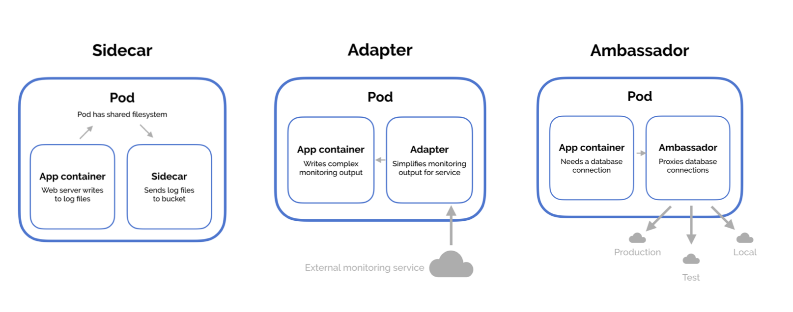

# Multi-Containers-Pod

Containers in the same pod share same lifecycle, resources and have access to the volume.

Grouping multiple co-located and co-managed containers in a single Pod is a relatively advanced use case. You should use this pattern only in specific instances in which your containers are tightly coupled. (But they all look same in Pod manifest)

## Design Pattern



- Sidecar Pattern

The sidecar pattern consists of a main application—i.e. your web application—plus a helper container with a responsibility that is essential to your application, but is not necessarily part of the application itself.

- Adapter pattern

The adapter pattern is used to standardize and normalize application output or monitoring data for aggregation.

- Ambassador pattern

The ambassador pattern is a useful way to connect containers with the outside world. An ambassador container is essentially a proxy that allows other containers to connect to a port on localhost while the ambassador container can proxy these connections to different environments depending on the cluster's needs.

## Init Containers

In a multi-container pod, each container is expected to run a process that stays alive as long as the POD's lifecycle. If any of them fails, the POD restarts.

But at times you may want to run a process that runs to completion in a container. For example a process that pulls a code or binary from a repository that will be used by the main web application. That is a task that will be run only one time when the pod is first created. Or a process that waits for an external service or database to be up before the actual application starts. That's where initContainers comes in.

An `initContainer` is configured in a pod like all other containers, except that it is specified inside a initContainers section, like this:

```
apiVersion: v1
kind: Pod
metadata:
  name: myapp-pod
labels:
  app: myapp
spec:
  containers:
  - name: myapp-container
    image: busybox:1.28
    command: ['sh', '-c', 'echo The app is running! && sleep 3600']
  initContainers:
  - name: init-myservice
    image: busybox
    command: ['sh', '-c', 'git clone <some-repository-that-will-be-used-by-application> ;']

```

When a POD is first created the initContainer is run, and the process in the initContainer **must** run to a completion before the real container hosting the application starts.

A Pod can have multiple containers running apps within it, but it can also have one or more init containers, which are run before the app containers are started.

Init containers are exactly like regular containers, except:

- Init containers always run to completion.
- Each init container must complete successfully before the next one starts.

If any of the initContainers fail to complete, Kubernetes restarts the Pod repeatedly until the Init Container succeeds.
