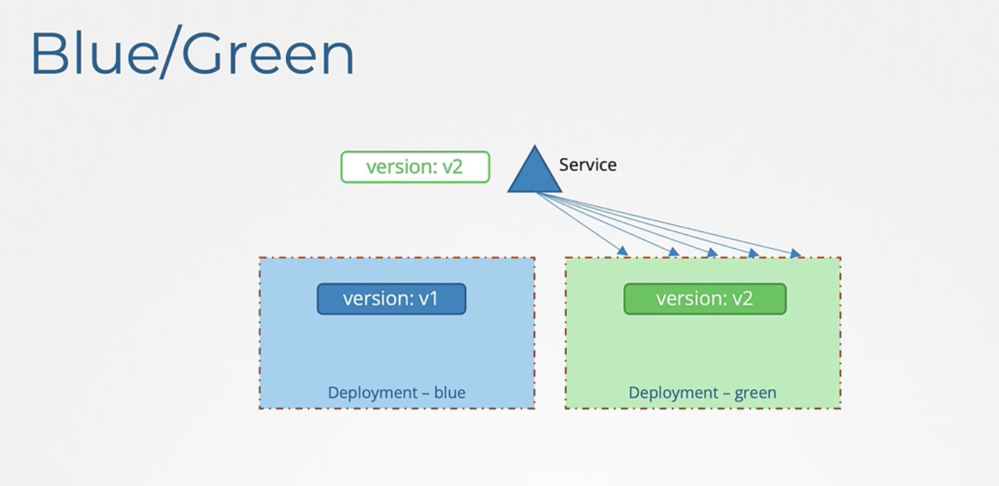

# Labels and Selectors

Labels are key/value pairs that are attached to objects such as Pods.

Labels are intended to be used to specify identifying attributes of objects that are meaningful and relevant to users, but do not directly imply semantics to the core system.

```
"metadata": {
  "labels": {
    "key1" : "value1",
    "key2" : "value2"
  }
}
```

labels do not provide `uniqueness`. In general, we expect many objects to carry the same label(s).

Via a `label selector`, the client/user can identify a set of objects. The label selector is the core grouping primitive in Kubernetes.

`k get pods --selector <key>=<value>`

# Annotations

Use Kubernetes annotations to attach arbitrary non-identifying metadata to objects.

Annotations are not used to identify and select objects.

```
"metadata": {
  "annotations": {
    "key1" : "value1",
    "key2" : "value2"
  }
}
```

The keys and the values in the map must be strings. In other words, you cannot use numeric, boolean, list or other types for either the keys or the values.

# Deployment

2 types of deployment strategy:

- rolling upgrade (default, no downtime)
- recreate

- blue/green (using labels to direct service traffic as a whole into new version once all upgrading is done)




- canary


# Jobs

A Job creates one or more Pods and will continue to retry execution of the Pods until a specified number of them successfully terminate.

```
apiVersion: batch/v1
kind: Job
metadata:
  name: pi
spec:
  template:
    spec:
      containers:
      - name: pi
        image: perl:5.34.0
        command: ["perl",  "-Mbignum=bpi", "-wle", "print bpi(2000)"]
      restartPolicy: Never
  completions: 3 ## running 3 pods
  backoffLimit: 4
  parallelism: 3 ## the number of pods creating in parallel
```

if multiple Pods, it will be created one by one (finishing the first, then another) by default.

Deleting the job will also deleting the Pods created by the job.

## Backoff limit

Set `.spec.backoffLimit` to specify the number of `retries` before considering a Job as failed.
The back-off limit is set by default to 6.
Failed Pods associated with the Job are recreated by the Job controller.

## Comparing to Deployment

Kubernetes Jobs are designed for running batch tasks that complete and then terminate, while Deployments are used for managing long-running, continuously available applications

## Cron job

```
apiVersion: batch/v1
kind: CronJob
metadata:
  name: hello
spec:
  schedule: "* * * * *"
  jobTemplate:
    spec:
      template:
        spec:
          containers:
          - name: hello
            image: busybox:1.28
            imagePullPolicy: IfNotPresent
            command:
            - /bin/sh
            - -c
            - date; echo Hello from the Kubernetes cluster
          restartPolicy: OnFailure

```
