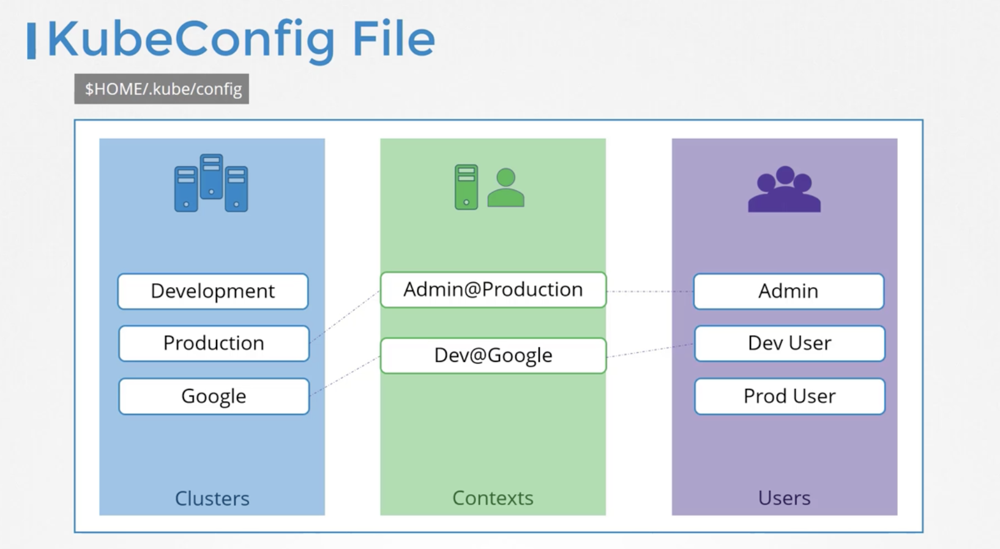
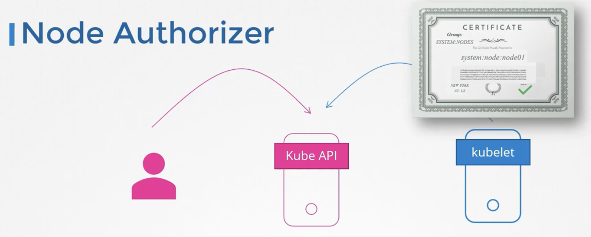

# Security

## Access to K8s Cluster

### Authentication: Who can access?

All Kubernetes clusters have two categories of users: service accounts managed by Kubernetes, and normal users.

Kubernetes does not have objects which represent normal user accounts. Normal users cannot be added to a cluster through an API call.

Service accounts are users managed by the `Kubernetes API`. They are bound to specific namespaces, and created automatically by the API server or manually through API calls.

#### Using KubeContext



```
apiVersion: v1
kind: Config
# clusters refers to the remote service.
clusters:
  - name: name-of-remote-authn-service
    cluster:
      certificate-authority: /path/to/ca.pem         # CA for verifying the remote service.
      server: https://authn.example.com/authenticate # URL of remote service to query. 'https' recommended for production.

# users refers to the API server's webhook configuration.
users:
  - name: name-of-api-server
    user:
      client-certificate: /path/to/cert.pem # cert for the webhook plugin to use
      client-key: /path/to/key.pem          # key matching the cert

# kubeconfig files require a context. Provide one for the API server.
current-context: webhook
contexts:
- context:
    cluster: name-of-remote-authn-service
    user: name-of-api-server
  name: webhook
```

### Authorization: What can they do?

Authoriation mode: Node, ABAC, RABC, Webhook, Always Deny, Always Allow

#### Node authorizer

The Node authorizer allows a `kubelet` to perform API operations. This includes:

- Read operations:

  - services
  - endpoints
  - nodes
  - pods
  - secrets, configmaps, persistent volume claims and persistent volumes related to pods bound to the kubelet's node

- Write operations:

  - nodes and node status (enable the NodeRestriction admission plugin to limit a kubelet to modify its own node)
  - pods and pod status (enable the NodeRestriction admission plugin to limit a kubelet to modify pods bound to itself)
  - events

- Auth-related operations:
  - read/write access to the CertificateSigningRequests API for TLS bootstrapping
  - the ability to create TokenReviews and SubjectAccessReviews for delegated authentication/authorization checks



#### ABAC (Attribute based access control)

Attribute-based access control (ABAC) defines an access control paradigm whereby access rights are granted to users through the use of policies which combine attributes together.

To enable ABAC mode, specify --authorization-policy-file=SOME_FILENAME and --authorization-mode=ABAC on startup.

#### RBAC (Role based access control)

Role-based access control (RBAC) is a method of regulating access to computer or network resources based on the roles of individual users within your organization.

RBAC authorization uses the rbac.authorization.k8s.io API group to drive authorization decisions, allowing you to dynamically configure policies through the Kubernetes API.

To enable RBAC, start the API server with the `--authorization-mode` flag set to a comma-separated list that includes RBAC; for example:

`kube-apiserver --authorization-mode=Example,RBAC --other-options --more-options`

##### Role + Role binding

Role and Rolebinding are namespaced.

Role example:

```
apiVersion: rbac.authorization.k8s.io/v1
kind: Role
metadata:
  namespace: default
  name: pod-reader
rules:
- apiGroups: [""] # "" indicates the core API group
  resources: ["pods"]
  verbs: ["get", "watch", "list"]
```

Role binding

This role binding example allows "jane" to read pods in the "default" namespace.
You need to already have a Role named "pod-reader" in that namespace.

```
apiVersion: rbac.authorization.k8s.io/v1
kind: RoleBinding
metadata:
  name: read-pods
  namespace: default
subjects:
# You can specify more than one "subject"
- kind: User
  name: jane # "name" is case sensitive
  apiGroup: rbac.authorization.k8s.io
roleRef:
  # "roleRef" specifies the binding to a Role / ClusterRole
  kind: Role #this must be Role or ClusterRole
  name: pod-reader # this must match the name of the Role or ClusterRole you wish to bind to
  apiGroup: rbac.authorization.k8s.io
```

##### Cluster Role + Cluster Role binding

Role + RoleBinding are namespaced, they are not available beyond the namespace.

Cluster role + Cluster role binding are cross cluster.

#### Admission Controllers

An admission controller is a piece of code that intercepts requests to the Kubernetes API server prior to persistence of the object, but after the request is authenticated and authorized.

Admission controllers may be validating, mutating, or both. Mutating controllers may modify objects related to the requests they admit; validating controllers may not.

Admission is divided into two phases.
In the first phase, only mutating admission plugins run. In the second phase, only validating admission plugins run.
