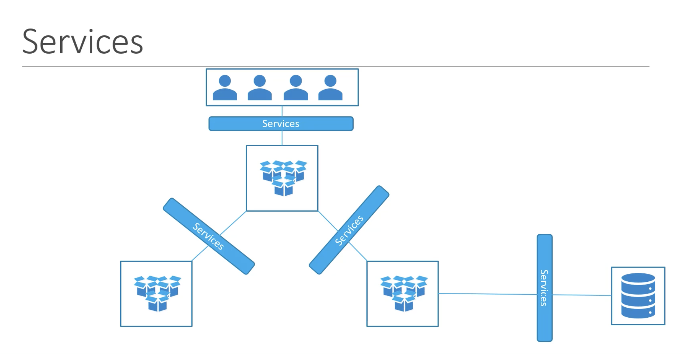
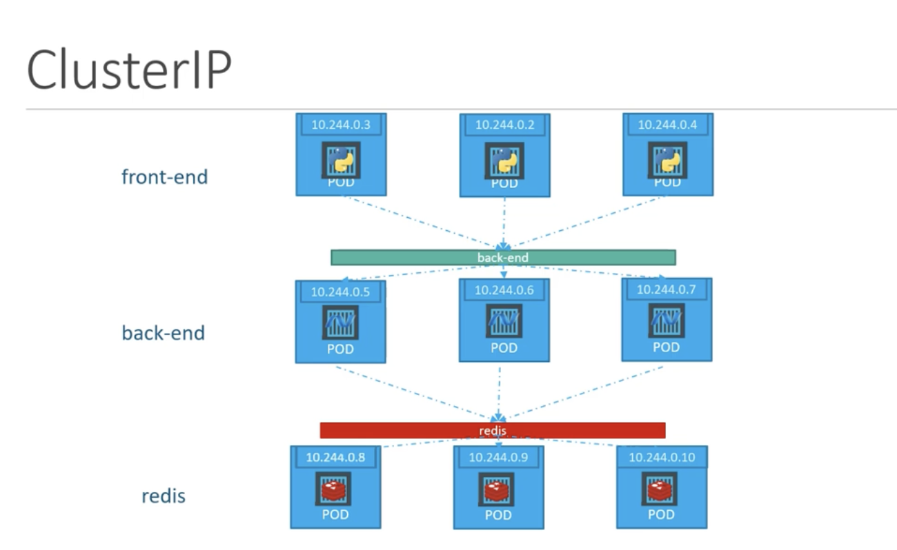
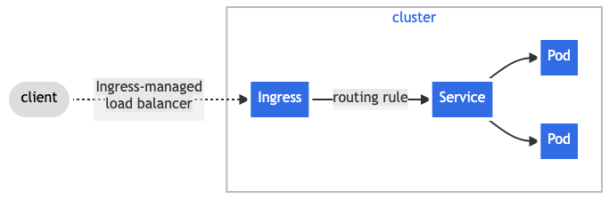
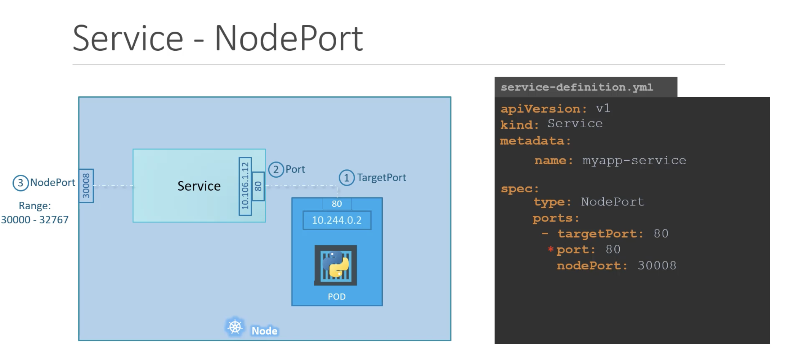
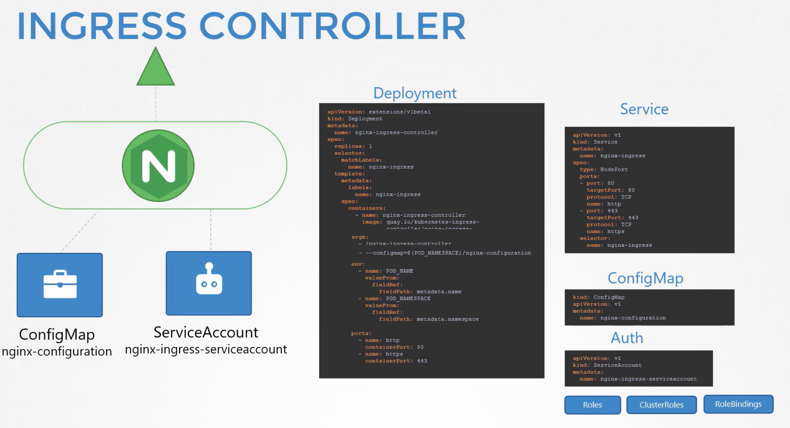

# Services



Service is a method for exposing a network application that is running as one or more Pods in your cluster.
Each Service object defines a logical set of endpoints (usually these endpoints are Pods) along with a policy about how to make those pods accessible.

For example, suppose you have a set of Pods that each listen on TCP port 9376 and are labelled as app.kubernetes.io/name=MyApp. You can define a Service to publish that TCP listener:

```
apiVersion: v1
kind: Service
metadata:
  name: my-service
spec:
  selector:
    app.kubernetes.io/name: MyApp
  ports:
    - protocol: TCP
      port: 80
      targetPort: 9376
```

## Service Type

#### ClusterIP (default)

Exposes the Service on a cluster-internal IP. Choosing this value makes the Service only reachable from `within the cluster`.

Good use case:



You can expose the Service to the public internet using an `Ingress` or a `Gateway`.



#### NodePort

Exposes the Service on each Node's IP at a static port (the NodePort). To make the node port available, Kubernetes sets up a cluster IP address, the same as if you had requested a Service of type: `ClusterIP`.



use Selector (metadata.labels) to bind with pods.

```
---
apiVersion: v1
kind: Service
metadata:
  name: webapp-service
  namespace: default
spec:
  ports:
  - nodePort: 30080
    port: 8080
    targetPort: 8080
  selector:
    name: simple-webapp
  type: NodePort
```

Multiple pods are the same config.

#### LoadBalancer

Exposes the Service externally using an `external load balancer`. Kubernetes does not directly offer a load balancing component; you must provide one, or you can integrate your Kubernetes cluster with a cloud provider.

#### ExternalName

Maps the Service to the contents of the externalName field (for example, to the hostname api.foo.bar.example). The mapping configures your cluster's DNS server to return a CNAME record with that external hostname value. No proxying of any kind is set up.

# Ingress

Ingress exposes HTTP and HTTPS routes from outside the cluster to services within the cluster. Traffic routing is controlled by rules defined on the Ingress resource.

**Ingress = Ingress Controller + Ingress resources**

An Ingress may be configured to give Services externally-reachable URLs, load balance traffic, terminate SSL / TLS, and offer name-based virtual hosting. An `Ingress controller` is responsible for fulfilling the Ingress, usually with a load balancer, though it may also configure your edge router or additional frontends to help handle the traffic.

An Ingress does not expose arbitrary ports or protocols. Exposing services other than HTTP and HTTPS to the internet typically uses a service of type `Service.Type=NodePort` or `Service.Type=LoadBalancer`.

You must have an `Ingress controller` to satisfy an `Ingress`. Only creating an `Ingress resource` has no effect.

## Ingress Controller



## Ingress resources

A minimal Ingress resource example:

```
apiVersion: networking.k8s.io/v1
kind: Ingress
metadata:
  name: minimal-ingress
  annotations:
    nginx.ingress.kubernetes.io/rewrite-target: /
spec:
  ingressClassName: nginx-example
  rules:
  - host: host.link.whatever ## host is optional
    http:
      paths:
      - path: /testpath
        pathType: Prefix
        backend:
          service:
            name: service-name
            port:
              number: 80

```
