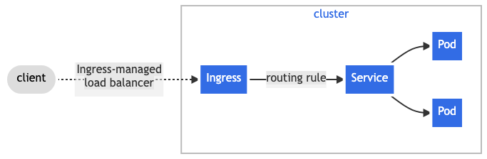
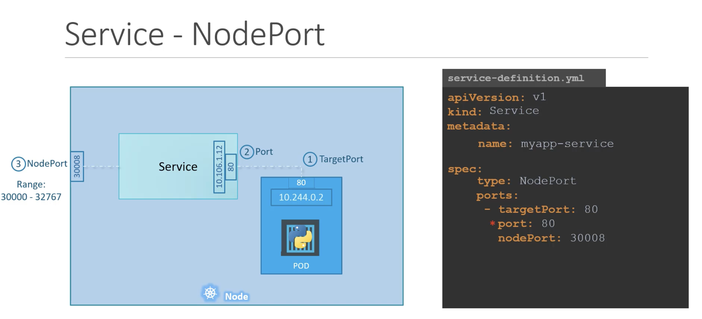
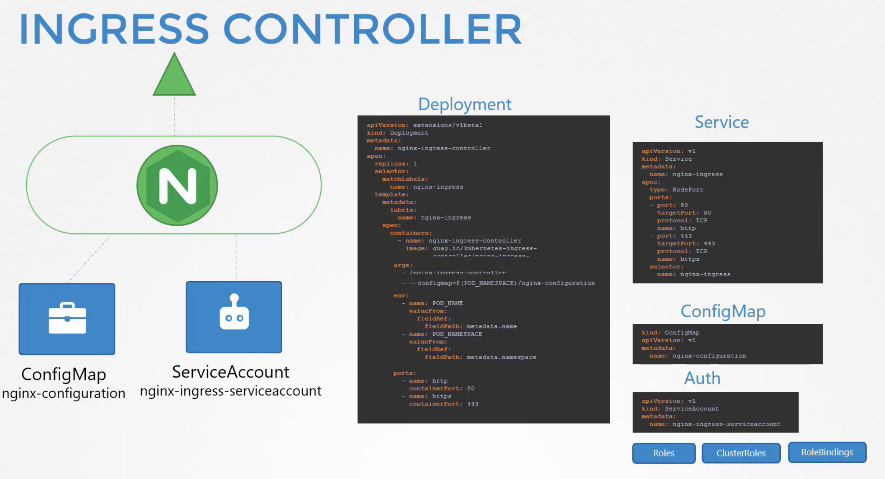

# Services


Service is a method for exposing a network application that is running as one or more Pods in your cluster.
Each Service object defines a logical set of endpoints (usually these endpoints are Pods) along with a policy about how to make those pods accessible.

For example, suppose you have a set of Pods that each listen on TCP port 9376 and are labelled as app.kubernetes.io/name=MyApp. You can define a Service to publish that TCP listener:

```
apiVersion: v1
kind: Service
metadata:
  name: my-service
spec:
  selector:
    app.kubernetes.io/name: MyApp
  ports:
    - protocol: TCP
      port: 80
      targetPort: 9376
```

## Service Type

#### ClusterIP (default)

Exposes the Service on a cluster-internal IP. Choosing this value makes the Service only reachable from `within the cluster`.

Good use case:


You can expose the Service to the public internet using an `Ingress` or a `Gateway`.



#### NodePort

Exposes the Service on each Node's IP at a static port (the NodePort). To make the node port available, Kubernetes sets up a cluster IP address, the same as if you had requested a Service of type: `ClusterIP`.



use Selector (metadata.labels) to bind with pods.

```
---
apiVersion: v1
kind: Service
metadata:
  name: webapp-service
  namespace: default
spec:
  ports:
  - nodePort: 30080
    port: 8080
    targetPort: 8080
  selector:
    name: simple-webapp
  type: NodePort
```

Multiple pods are the same config.

#### LoadBalancer

Exposes the Service externally using an `external load balancer`. Kubernetes does not directly offer a load balancing component; you must provide one, or you can integrate your Kubernetes cluster with a cloud provider.

#### ExternalName

Maps the Service to the contents of the externalName field (for example, to the hostname api.foo.bar.example). The mapping configures your cluster's DNS server to return a CNAME record with that external hostname value. No proxying of any kind is set up.

# Ingress

Ingress exposes HTTP and HTTPS routes from outside the cluster to services within the cluster. Traffic routing is controlled by rules defined on the Ingress resource.

**Ingress = Ingress Controller + Ingress resources**

An Ingress may be configured to give Services externally-reachable URLs, load balance traffic, terminate SSL / TLS, and offer name-based virtual hosting. An `Ingress controller` is responsible for fulfilling the Ingress, usually with a load balancer, though it may also configure your edge router or additional frontends to help handle the traffic.

An Ingress does not expose arbitrary ports or protocols. Exposing services other than HTTP and HTTPS to the internet typically uses a service of type `Service.Type=NodePort` or `Service.Type=LoadBalancer`.

You must have an `Ingress controller` to satisfy an `Ingress`. Only creating an `Ingress resource` has no effect.

## Ingress Controller



## Ingress resources

A minimal Ingress resource example:

```
apiVersion: networking.k8s.io/v1
kind: Ingress
metadata:
  name: minimal-ingress
  annotations:
    nginx.ingress.kubernetes.io/rewrite-target: /
spec:
  ingressClassName: nginx-example
  rules:
  - host: host.link.whatever ## host is optional
    http:
      paths:
      - path: /testpath
        pathType: Prefix
        backend:
          service:
            name: service-name
            port:
              number: 80

```

# Network policy

NetworkPolicies are an application-centric construct which allow you to specify how a **pod** is allowed to communicate with various network "entities" (we use the word "entity" here to avoid overloading the more common terms such as "endpoints" and "services", which have specific Kubernetes connotations) over the network.

NetworkPolicies apply to a connection with a pod on one or both ends, and are not relevant to other connections.

The entities that a Pod can communicate with are identified through a combination of the following three identifiers:

- Other pods that are allowed (exception: a pod cannot block access to itself)
- Namespaces that are allowed
- IP blocks (exception: traffic to and from the node where a Pod is running is always allowed, regardless of the IP address of the Pod or the node)

When defining a pod- or namespace-based NetworkPolicy, you use a selector to specify what traffic is allowed to and from the Pod(s) that match the selector.

Meanwhile, when IP-based NetworkPolicies are created, we define policies based on IP blocks (CIDR ranges).

```
apiVersion: networking.k8s.io/v1
kind: NetworkPolicy
metadata:
  name: test-network-policy
  namespace: default
spec:
  podSelector:
    matchLabels:
      role: db
  policyTypes:
  - Ingress
  - Egress # if not specified, no isolation
  ingress:
  - from:
    - ipBlock:
        cidr: 172.17.0.0/16
        except:
        - 172.17.1.0/24
    - namespaceSelector:
        matchLabels:
          project: myproject
    - podSelector:
        matchLabels:
          role: frontend
    ports:
    - protocol: TCP
      port: 6379
  egress:
  - to:
    - ipBlock:
        cidr: 10.0.0.0/24
    ports:
    - protocol: TCP
      port: 5978
```

The above example NetworkPolicy:

- isolates role=db pods in the default namespace for both ingress and egress traffic (if they weren't already isolated)

- (Ingress rules) allows connections to all pods in the default namespace with the label role=db on TCP port 6379 from:

  - any pod in the default namespace with the label `role=frontend`
  - any pod in a namespace with the label `project=myproject`
  - IP addresses in the ranges `172.17.0.0–172.17.0.255` and `172.17.2.0–172.17.255.255` (ie, all of 172.17.0.0/16 except 172.17.1.0/24)

- (Egress rules) allows connections from any pod in the default namespace with the label role=db to CIDR 10.0.0.0/24 on TCP port 5978.

If no policies attached, K8s allows all traffic in and out of Pods.

### Extended

```
apiVersion: networking.k8s.io/v1
kind: NetworkPolicy
metadata:
  name: internal-policy
  namespace: default
spec:
  podSelector:
    matchLabels:
      name: internal
  policyTypes:
  - Egress
  - Ingress
  ingress:
    - {}
  egress:
  - to:
    - podSelector:
        matchLabels:
          name: mysql
    ports:
    - protocol: TCP
      port: 3306

  - ports:
    - port: 53
      protocol: UDP
    - port: 53
      protocol: TCP
```

The last `ports` in egress section allows egress traffic to DNS ports TCP and UDP (port 53) to enable DNS resolution from the internal pod.
