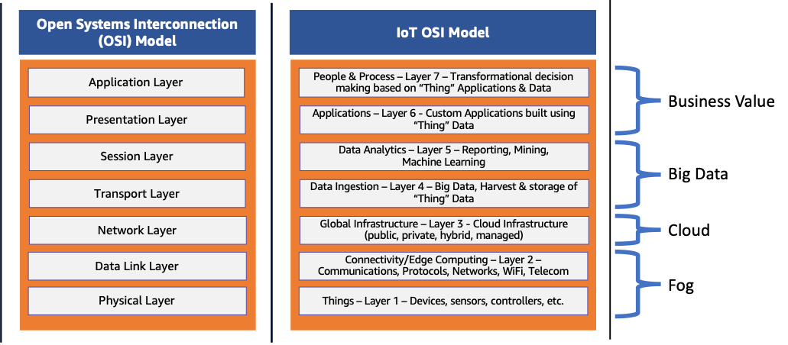
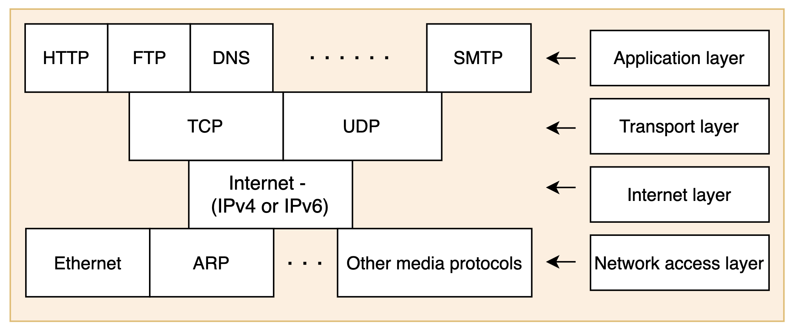

Learn about the layered architecture of the internet to better understand how APIs work.

# Layerd architecture

_why need layered architecture?_

A layered approach divides the large task into smaller tasks, making it easy to solve the bigger problem. To communicate between any two systems sharing a network (for instance, client-server communication), the request is communicated from one layer to the next, where each layer performs its set of tasks.

- Provides modularity so that each layer performs its own operations.
- Provides ease in troubleshooting the network.
- Modification in one layer has no impact on the other.
- Flexibly accommodates different types of applications.

# Layered models

The implementation of layered architectures.

## OSI model (Open system interconnection)

The common-said 7 layers, each with a header containing information about the protocol in use, addresses, sequence number, and so on.

- **Application layer**: The sender interacts with the application layer, and it includes different protocols, for example, HTTP and SMTP protocols.

REST, as an API paradigm, also operates within the Application Layer.

- **Presentation layer**: It takes care of the data's format and syntax on the sender and receiver sides. It ensures the data is understandable at the receiver end. For example, Hypertext Markup Language (HTML), JavaScipt Object Notation (JSON), and Comma Separated Values (CSV) are all modeling languages to describe the structure of data at the presentation layer. Also, it may perform encryption, decryption, and compression of the data.

- **Session layer**: It creates, manages, and terminates the sessions between end-to-end devices.A session manages the beginning and ending of a one-to-one application connection and synchronization conflicts. It’s also responsible for authentication and reconnections.

- **Transport layer**: It’s responsible for ensuring that data packets arrive in the right order, without losses or errors, or can be seamlessly recovered if required. Flow control, along with error control, is often a focus at the transport layer.

At this layer, commonly used protocols include the Transmission Control Protocol (TCP), a near-lossless connection-based protocol, and the User Datagram Protocol (UDP), a lossy connectionless protocol. TCP is commonly used where all data must be intact (e.g. file share), whereas UDP is used when retaining all packets is less critical (e.g. video streaming).

_Above 4 layers only present on the end hosts, not on the routes._

- **Network layer**: IP addressing and routing is the responsibility of the network layer. A node connected to the internet needs to have an IP address for communication with peers.
  Across the internet, the Internet Protocol v4 (IPv4) and IPv6 are used as the main network layer protocols.

- **Data link layer**: This layer is responsible for frame transmission, address for local area network (LAN), and logical link control. In OSI models, the data unit is considered to be a packet in the network layer and a frame in the data link layer.
  The data link layer is often split into two sub-layers: the Media Access Control (MAC) layer and Logical Link Control (LLC) layer.

- **Physical layer**: It handles the transmission of bitstreams on the physical link between the sender and the immediate next hop receiver. The physical link can be Ethernet, DSL, and so forth. At its core, data communication is the transfer of digital and electronic signals through various physical channels like fiber-optic cables, copper cabling, and air. The physical layer includes standards for technologies and metrics closely related with the channels, such as Bluetooth, NFC, and data transmission speeds.

Not all systems that use the OSI model implement every layer. The OSI model is always considered as a reference model. At first, nobody understood what session and presentation layers do, because these layers were more specific to the applications, not the network. These two layers could have been merged into the application layer (something that the TCP/IP model did).

## The TCP/IP model

The TCP/IP model is comprised of four different layers:

- The network access layer
- The network layer
- The transport layer
- The application layer

While layers like the transport layer, network layer, and application layer appear to map directly to the OSI model, this isn’t quite the case. Instead, the TCP/IP model most accurately maps to the structure and protocols of the internet.

The OSI model remains a popular networking model to describe how networking operates from a holistic perspective for educational purposes. However, the TCP/IP model is now more commonly used in practice.

# HTTP is the new narrow waist of the Internet

The IP (Internet protocol) used to be the bottole neck for the internet because the IP extends its support to many upper-layer transport and application protocols and many bottom-layer communication technologies.

With the usage of APIs over the web, businesses depend on HTTP to exchange data, make development faster, and add functionalities in little to no time, without rewriting code. With such a level of reliance on HTTP, it’s safe to deduce that the new narrow waist of the Internet is HTTP. This means that the majority of traffic on the web runs over the HTTP protocol.

HTTP is used as the engine to run REST APIs: REST is an architectural style for designing networked applications, while HTTP is a specific protocol used for communication, and REST APIs often leverage HTTP for their implementation.

Nonetheless, HTTP requires transmission (TCP) and security protocols (TLS) for safe communication. This means that the narrow waist of the Internet can be expanded to include IP, TCP, TLS, and HTTP.
