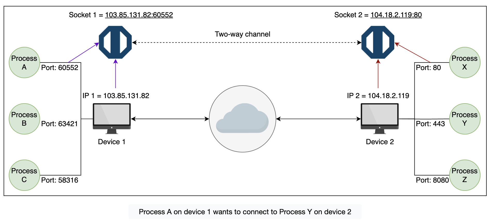
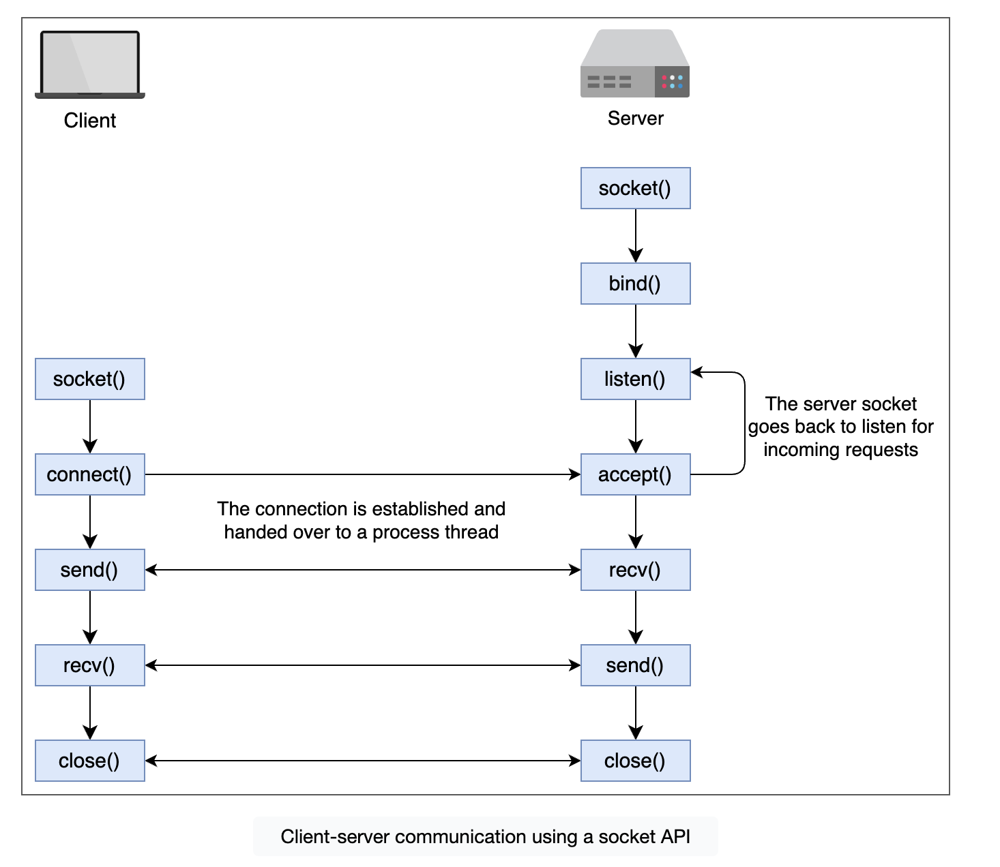

Learn about network sockets and their types.

APIs provide services by exchanging information between client and server processes. The underlying network stack usually abstracts this interprocess communication, but how is it done?

When we build a network application it is crucial to understand how processes on different hosts communicate with each other. For each pair of communicating processes, we label one of them as a client, and the other as the server. Usually, the client is the one that initiates the communication, and the server the one that waits to be contacted. In the web, the client would the the web browser, and the server the web server which serves the web page.

Any message sent from one process to another, must go through the underlying layers. The software interface between these layers is called a socket. Using a metaphor, the process is analogous to a house and a socket to its door. When a process sends a message to another process, it sends it through the door and it must also go into the other process’ door.

Popular API technologies such as RESTful, GraphQL, and gRPC work differently, but at the most basic level, they all use socket interfaces for **process identification, connection establishment, and interprocess communication**.

# Socket

A socket is an interface that creates a two-way channel between processes communicating on different devices.

Processes running on the _application layer_ use sockets as an interface to take services from the _transport layer_ to establish communication.

Further, the interfacing requires an IP address and a port number to uniquely identify a process or application globally. The interface (IP address + port) is referred to as a socket address.

Two different sockets (endpoints) are required for any two processes to communicate.one for each.

Finally, the transport protocol (TCP or UDP) specified in the transport layer of the network stack is responsible for successfully exchanging data between these processes. All this information is present in the network stack, and we can access it using a single interface from the network socket

**Sockets enable the simultaneous creation of multiple communication channels on a single machine, with different port numbers.**

Because the size of the port number is 16 bits, the maximum number of ports on a machine is limited to 65,536. But as one machine can have multiples, the possible connections could be more.

## Socket types

Network sockets can be categorized into two general types based on the transport protocol.

### Stream sockets (TCP)

A stream socket provides a sequenced and unique flow of error-free data without record boundaries, with well-defined mechanisms for creating and destroying connections and reporting errors. A stream socket transmits data reliably, in order, and with out-of-band (传输层带外数据) capabilities. On the Internet, stream sockets are typically implemented using TCP so that applications can run across any networks using TCP/IP protocol.

It also utilizes the recovery facility of the underlying protocol (for example, TCP) to retransmit the lost data during the data propagation phase.

(A stream socket is 3-tuples of information containing IP, port, and transport protocol.)

### Datagram sockets (UDP)

Datagram sockets don’t create an end-to-end channel between two endpoints to transfer data between processes. It just sends data and expects it to reach the receiver end. It’s used in scenarios where data loss is not significant.

Since the communication is stateless and doesn’t even contain packet sequence numbers, it’s nearly impossible to identify data lost during the propagation phase.
(However, there are protocols that work on top of UDP and use application-level sequencing to make the communication reliable. While data flows in only one direction in the diagram above, the receiver can also send data in the other direction using the sender IP and port defined in the datagram socket.)

## Socket works in API development

Common Socket API Calls:

- server: socket(), bind(), listen(), accept(), receive(),send(),close()
- client: socket(), connect(),,send(), receive(),close()
