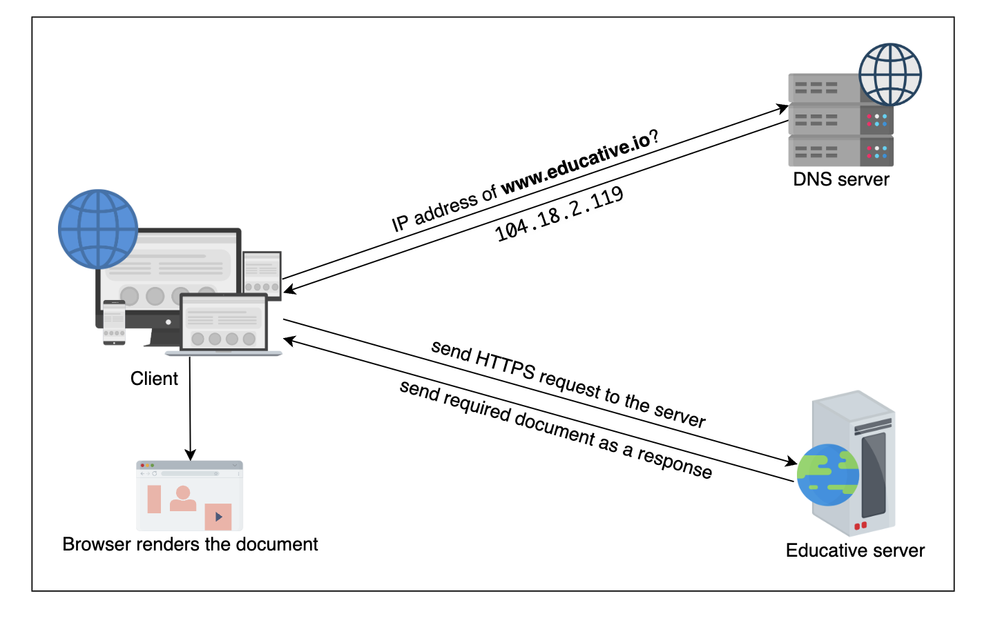

Learn about the World Wide Web, how it works, and its evolution.

The World Wide Web (WWW) is a hypertext-based information system that interlinks documents spread and stored across millions of machines all over the Internet. It’s commonly known as the web or w3.

_What is the difference between the Internet and the web?_

A: The Internet is a network of networks with a series of interconnected nodes that can communicate with each other. In contrast, the web is one of the applications built on the Internet.

# Web Concepts

the web is a combination of the following four basic ideas:

- Client-server model
- Resource identifiers: Uniform Resource Identifier (URI)
  
- Hypertext and hypermedia: Hypertext is a text that is not linear, but instead contains links to other documents. Hypermedia is an extension of the hypertext, where along with the text (hypertext), the documents contain multimedia content such as graphics, animations, images, videos, audio, and interactive elements (such as embedded programs).
- Markup language: includes a set of symbols inserted in a text document to configure and style its structure, formatting, or connection between its parts. e.g. HTML

# Web Protocols

The client application, usually a browser, displays the data received from the server in a specific format— **a web page**. This information flow between clients and servers is directed by a protocol called **Hypertext Transfer Protocol (HTTP)**.

Application layer protocols such as the File Transfer Protocol (FTP), Simple Message Transport Protocol (SMTP), HTTP, and so on, use lower layer protocols like Transmission Control Protocol (TCP), User Datagram Protocol (UDP), and Internet Protocol (IP) to provide services to end users.

_What’s the difference between static and dynamic web pages?_

A: Static web pages are based on Web 1.0, where content stored on the server is delivered to the client as is.
While, dynamic web pages emerged because of Web 2.0, where the end users interact with the page, and dynamic content gets rendered on the client-side. Dynamic content is generated by a server-side script or application and can change automatically. Furthermore, dynamic web pages are generated by server-side scripts (such as PHP, JSP, and so on), which are interpreted by the server, and the result is given to the user.
