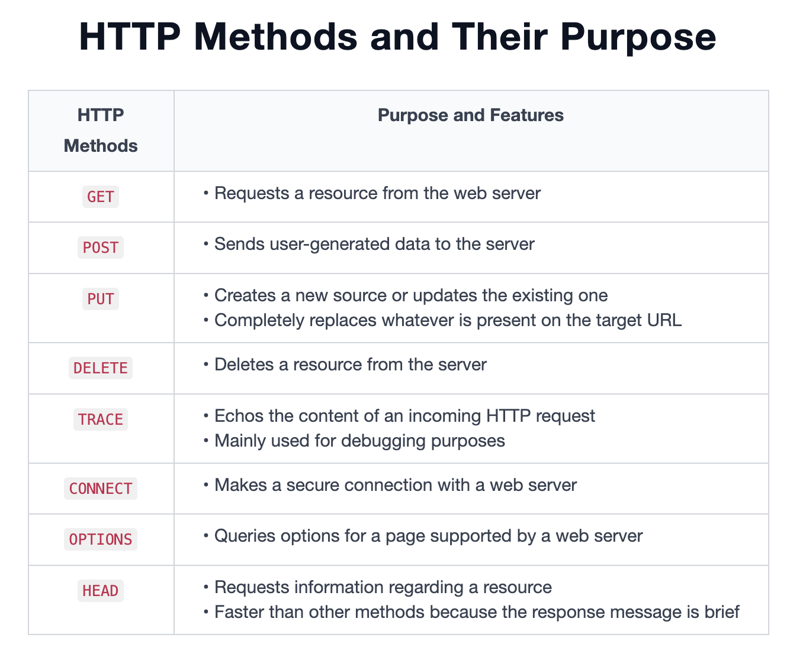

# HTTP

The Hypertext Transfer Protocol (HTTP) is a **stateless**, application-layer protocol for distributed and hypermedia information systems.

HTTP is based on the concepts of request and response. The client usually makes requests in the form of HTTP commands, and the server responds with data in the form of documents.

## HTTP requests/response structure

HTTP request includes Method,The request-target and version,Headers and Body.

The HTTP response has the same format as the request by replacing Method, URL and Version to be Version, Status Code and Phase.
The status code is a three-digit number that conveys what happened with the client’s request on the server-side. The phrase part is a group of words that convey some meaning along with the status codes, for example, some of the phrases are `OK`, `Moved Permanently`, `Bad Request`, `Not Found`, and `HTTP Version Not Supported`.

_In HTTP, why are the control (headers) and application data included in the same request/response message?_

A: The HTTP is a stateless protocol that implies that the server should not keep any data relevant to a request. Also it avoids sending too many requests, reducing the network’s resource consumption and data processing complexity on the client- and server-sides. Otherwise, we would be required to keep additional information both on the server- and client-sides.

## HTTP methods

### The significance of HTTP in APIs

- The HTTP protocol is well-known to many developers, so it’s simple to use, upgrade, and scale.
- It allows cross-platform and cross-language communication to support interoperability.
- It provides a uniform interface for communication between entities in the form of request and response messages.
- It’s a fast protocol because it requires minimal processing.
- Due to its adaptability, APIs based on it can achieve a wide range of goals. For example, making custom requests based on the use case and utilizing different built-in methods provided by HTTP.
- Repeat requests can be handled more quickly because responses can be cached.
- HTTP supports various types of encoding techniques that are helpful in various types of communication with the server via APIs. The encoding techniques are carefully opted to make an API efficient.

# HTTPS

HTTPS is HTTP over the Secure Sockets Layer (SSL), therefore, the entire HTTP request and response, including the headers and body, are encrypted while using HTTPS. Other details, such as the full domain or subdomain and the originating IP address, can be revealed via the DNS resolution and connection setup.
